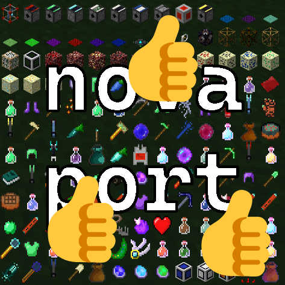

  

# NovaCyclic

A Spigot port of the popular Minecraft mod ["Cyclic"](https://www.curseforge.com/minecraft/mc-mods/cyclic) using the [Nova](https://github.com/xenondevs/Nova) framework!

Enrich your server's gameplay effortlessly with a modpack-like experience without the hassle of downloading and installing mods.

## Development

This Nova addon is incomplete and may be highly unstable and/or causing game-breaking issues while playing.